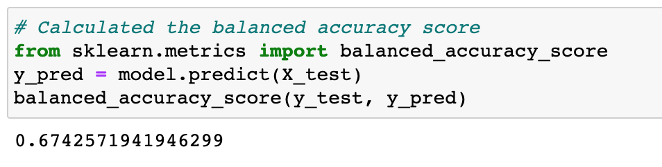
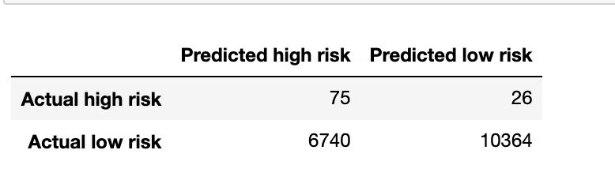
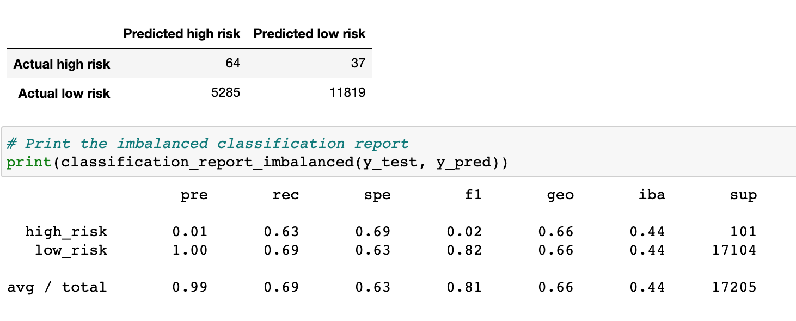
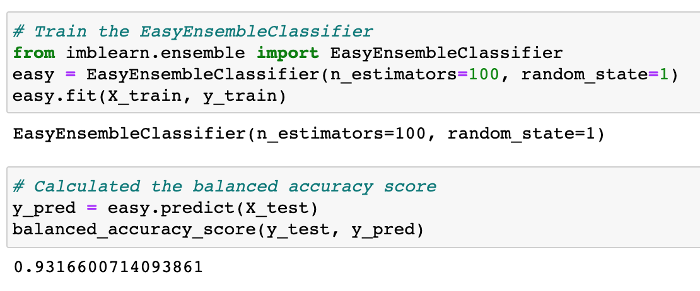

# Credit_Risk_Analysis

## Overview
In this project, we use Python and employ different machin leanrning techniques and models to train the unbalanced credit risk classes. In this project, we will use imbalanced-learn and scikit-learn libraries to build and evaluate models using resampling.
By using credit card credit dataset from LendingClub, we will perform the following:
* oversample the data using the RandomOverSampler and SMOTE algorithms.
* Undersample the data using the ClusterCentroids algorithm.
* Use a combinatorial approach of over- and undersampling using the SMOTEENN algorithm.
* Compare two machine learning models that reduce bias, BalancedRandomForestClassifier and EasyEnsembleClassifier.
At the end, we will evaluate the performance of different models and to determine which model should be use for predicting credit risk in the future dataset.

## Results

### Naive Random Oversampling
The balanced accuracy score for this model is 0.674. From the classification report, the precision for high risk is pretty low (0.01) with a sensitivity of 0.74. The F1 score is 0.02 for the high risk. The overall precision for the dataset is 0.99, with a sensitivity of 0.61. The F1 score is 0.75.

### SMOTE Oversampling
The balanced accuracy score for this model is 0.662. From the classification report, the precision for high risk is pretty low (0.01) with a sensitivity of 0.79. The F1 score is 0.02 for the high risk. The overall precision for the dataset is 0.99, with a sensitivity of 0.61. The F1 score is 0.81.

### Cluster Centroids Undersampling 
The balanced accuracy score for this model is 0.662. From the classification report, the precision for high risk is pretty low (0.01) with a sensitivity of 0.63. The F1 score is 0.02 for the high risk. The overall precision for the dataset is 0.99, with a sensitivity of 0.69. The F1 score is 0.81.

### SMOTEENN Combination Sampling
The balanced accuracy score for this model is 0.643. From the classification report, the precision for high risk is pretty low (0.01) with a sensitivity of 0.71. The F1 score is 0.02 for the high risk. The overall precision for the dataset is 0.99, with a sensitivity of 0.57. The F1 score is 0.72.

### Balanced Random Forest Classifier
The balanced accuracy score for this model is 0.788. From the classification report, the precision for high risk is pretty low (0.03) with a sensitivity of 0.70. The F1 score is 0.06 for the high risk. The overall precision for the dataset is 0.99, with a sensitivity of 0.87. The F1 score is 0.93.

### Easy Ensemble AdaBoost Classifier
The balanced accuracy score for this model is 0.932. From the classification report, the precision for high risk is pretty low (0.09) with a sensitivity of 0.92. The F1 score is 0.16 for the high risk. The overall precision for the dataset is 0.99, with a sensitivity of 0.94. The F1 score is 0.97.

## Summary
The "pre" column in the classification report tells us the precision of the prediction, while "rec" indicates the sensitivity of the dataset. "F1" score tells the percentage of correct positive prediction.
From the above result, it's clear to see that all the models perform a weak precision in determining the high credit risk. The Easy Ensmbel AdaBoost Classifier did improve in the accuracy score and sensitivity, but the low precision shows there are still alot wrong prediction occurs. So that I would not recommend the bank to use the models to predict credit risk.

